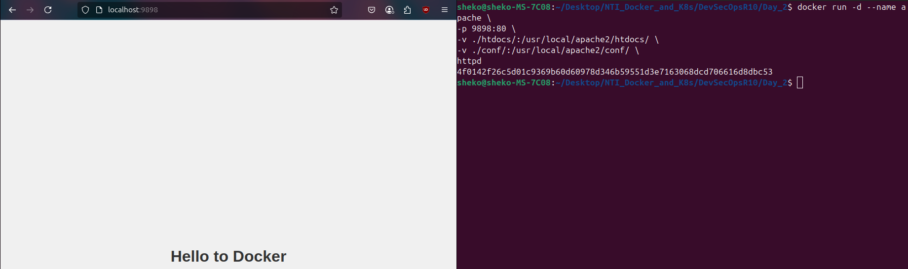

## Day 1
### Problem 1
1. Run the container `hello-world`:

2. Check the container status:

3. Start the stopped container:

4. Remove the container:

5. Remove the image:


---

### Problem 2
1. Run container centos or ubuntu in an interactive mode:

2. Run the following command in the container `echo docker`:

3. Open a bash shell in the container and touch a file named `hello-docker`:

4. Stop the container and remove it. Write your comment about the file `hello-docker`:
The file will be deleted with the container.

5. Remove all stopped containers:
```sh
docker container prune
```

---

### Problem 3
1. Run a container httpd with name apache and attach 2 volumes to the container:
- Volume1 for containing static html file.
- Volume2 for containing httpd configuration.
2. Remove the container:
    ```sh
    docker rm -f apache
    ```
3. Run a new container with the following:
- Attach the 2 volumes that was attached to the previous container.
- Map port 80 to port 9898 on you host machine.
- Access the html files from your browser.
#### Solution:
- Get the static html file path: `./staticWebPage.html`
- Get the default configuration file of apache2 (since we don't have a custom one):
    ```sh
    docker run --rm httpd cat /usr/local/apache2/conf/httpd.conf > custom-httpd.conf
    ```
- Finally, run:
```sh
docker run -d --name apache \
-p 9898:80 \
-v ./staticWebPage.html:/var/www/html/index.html \
-v ./custom-httpd.conf:/usr/local/apache2/conf/httpd.conf \
httpd
```


---

