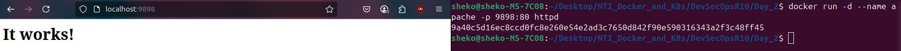
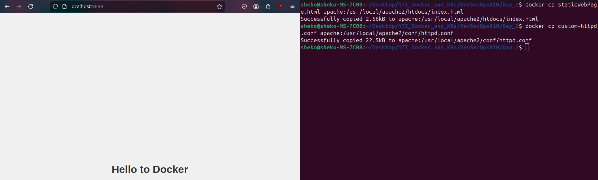
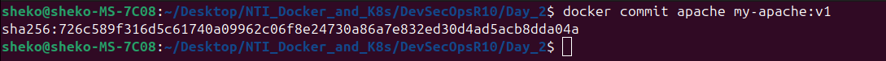
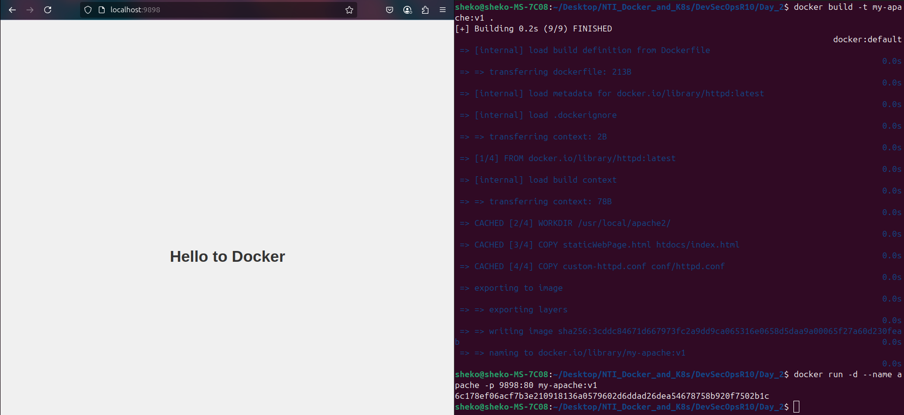
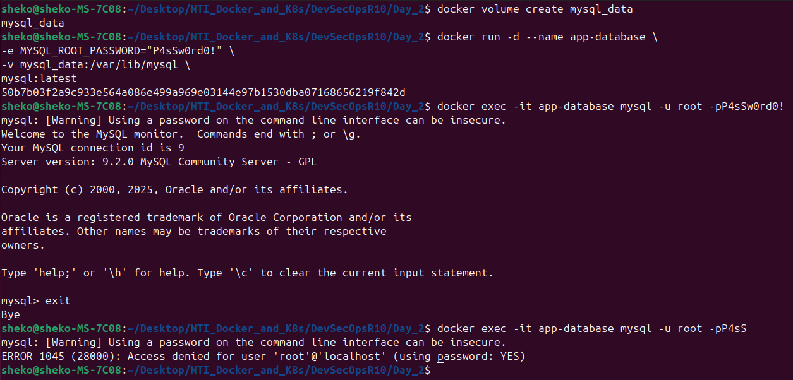

## Day 2
### Problem 4
1. Run the image `httpd` again without attaching any volumes:

2. Add html static files to the container and make sure they are accessible:

3. Commit the container with image name IMAGE_NAME:

4. Create a Dockerfile for the previous image and build the image from this [Dockerfile](Dockerfile):
```Dockerfile
FROM httpd:latest

WORKDIR /usr/local/apache2/

COPY staticWebPage.html htdocs/index.html

COPY custom-httpd.conf conf/httpd.conf

EXPOSE 80

ENTRYPOINT ["httpd-foreground"]
```


---

### Problem 5
1. Create a volume called `mysql_data`, then deploy a MySQL database called `app-database`.
```sh
docker volume create mysql_data
```
2. Use the `mysql` latest image, and use the `-e` flag to set `MYSQL_ROOT_PASSWORD` to `P4sSw0rd0!`.
3. Mount the `mysql_data` volume to `/var/lib/mysql`.
4. The container should run in the background.
```sh
docker run -d --name app-database \
-e MYSQL_ROOT_PASSWORD="P4sSw0rd0!" \
-v mysql_data:/var/lib/mysql \
mysql:latest
```
- To test the root password, run:
```sh
docker exec -it app-database mysql -u root -pP4sSw0rd0!
```


