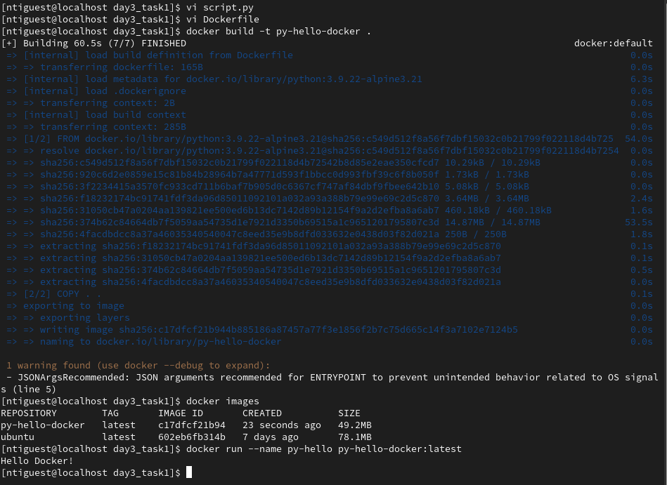

# Python Hello World with Docker
This is a simple Dockerized Python application that prints **"Hello Docker!"** when the container starts.

## 🐍 Description
- Uses the official `python:alpine` image.
- Contains a basic Python script that prints a message.
- Automatically runs the script on container startup.

## 📜 script.py
```python
print("Hello Docker!")
```

## 🐳 Dockerfile
```dockerfile
FROM python:3.9.22-alpine3.21

COPY . .

ENTRYPOINT python script.py
```

## 🚀 How to Run
1. Build the Docker image:
   ```bash
   docker build -t python-hello .
   ```
2. Run the container:
   ```bash
   docker run --rm python-hello
   ```
3. You should see:
   ```
   Hello Docker!
   ```


---

