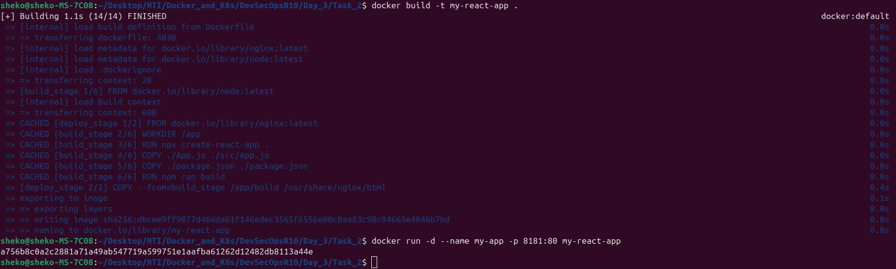
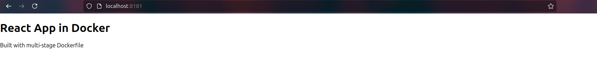

# React App with Multi-Stage Docker Build
This project demonstrates how to use **Docker multi-stage builds** to:
- Build a React application using the official `node` image.
- Serve the built static files using the official `nginx` image.

## 📁 Project Structure
```
.
├── Dockerfile
├── App.js               # Custom App component
└── package.json         # React dependencies
```

## 🐳 Dockerfile
```dockerfile
# Build Stage
FROM node:latest AS build_stage

WORKDIR /app

# Create React app
RUN npx create-react-app .

# Overwrite default App component and package.json
COPY ./App.js ./src/App.js
COPY ./package.json ./package.json

# Build the React app
RUN npm run build

# Deploy Stage
FROM nginx:latest AS deploy_stage

# Copy build output to NGINX's web directory
COPY --from=build_stage /app/build /usr/share/nginx/html

# Start NGINX in the foreground to keep the container alive
CMD ["nginx", "-g", "daemon off;"]
```

## 🚀 How to Run
1. Build the Docker image:
   ```bash
   docker build -t react-nginx-app .
   ```
2. Run the container:
   ```bash
   docker run -p 8181:80 react-nginx-app
   ```

3. Open your browser at:
   ```
   http://localhost:8181
   ```
   You should see your React app served by NGINX 🎉


---

