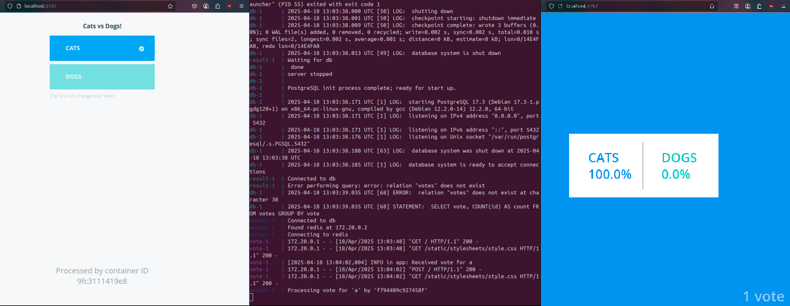

# Example Voting App
A simple distributed application running across multiple Docker containers.
This solution uses **Python**, **Node.js**, **.NET**, with **Redis** for messaging and **Postgres** for storage.

## Getting started
Make sure you have the latest version of [Compose](https://docs.docker.com/compose/install/).
To run the app, in this directory, run:
```bash
docker compose up
```
The `vote` app will be running at [http://localhost:8181](http://localhost:8181), and the `results` will be at [http://localhost:8282](http://localhost:8282).

## Architecture
* A front-end web app in [Python](/vote) which lets you vote between two options
* A [Redis](https://hub.docker.com/_/redis/) which collects new votes
* A [.NET](/worker/) worker which consumes votes and stores them in…
* A [Postgres](https://hub.docker.com/_/postgres/) database backed by a Docker volume
* A [Node.js](/result) web app which shows the results of the voting in real time


## Notes
- The voting application only accepts one vote per client browser. It does not register additional votes if a vote has already been submitted from a client.
- This isn't an example of a properly architected perfectly designed distributed app... it's just a simple example of the various types of pieces and languages you might see (queues, persistent data, etc), and how to deal with them in Docker at a basic level.

## Final Outputs:
<p align="center">
  <strong>Voting Cats</strong>
  <br>
  
</p>

<p align="center">
  <strong>Voting Dogs</strong>
  <br>
  
</p>
