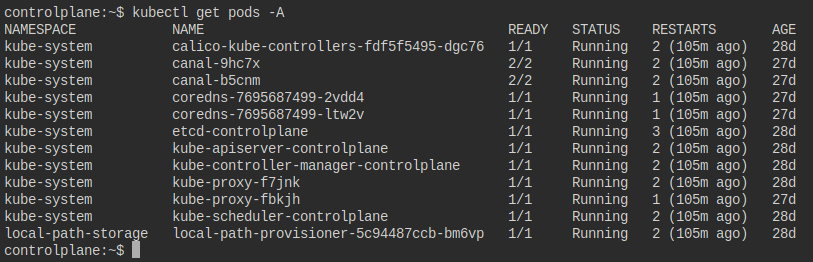
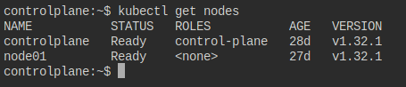
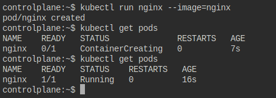
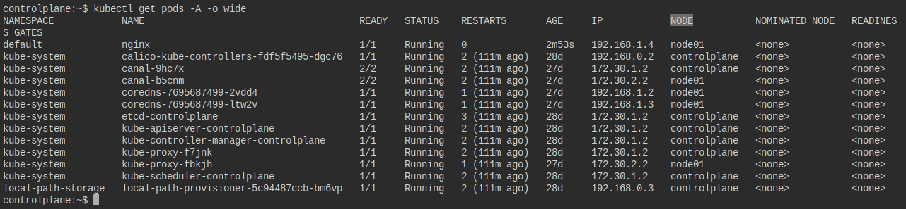
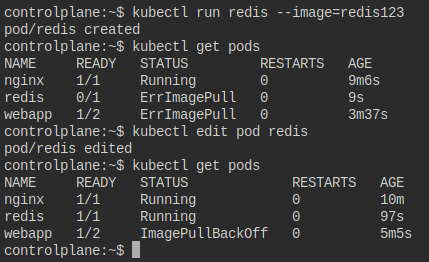

1. How many pods exist on the system?
    ```sh
    kubectl get pods -A --no-headers | wc -l
    ```
<p align="center">
  
</p>

2. How many Nodes exist on the system?
    ```sh
    kubectl get nodes --no-headers | wc -l
    ```
<p align="center">
  
</p>

3. Create a new pod with the `nginx` image. Image name: `nginx`
    ```sh
    kubectl run nginx --image=nginx
    ```
<p align="center">
  
</p>

4. Which nodes are these pods placed on?
    ```sh
    kubectl get pods -A -o wide
    ```
<p align="center">
  
</p>

5. Create pod from the below `yaml` using `kubectl` apply command:
    ```yaml
    apiVersion: v1
    kind: Pod
    metadata:
      name: webapp
      namespace: default
    spec:
      containers:
      - image: nginx
        imagePullPolicy: Always
        name: nginx
      - image: agentx
        imagePullPolicy: Always
        name: agentx
    ```
6. How many containers are part of the pod `webapp`?
-> 2
7. What images are used in the new `webapp` pod?
-> `nginx` while `agentx` is not pulled.
8. What is the state of the container `agentx` in the pod `webapp`?
-> `Waiting`, Reason: `ImagePullBackOff`
9. Why do you think the container `agentx` in pod `webapp` is in error?
-> Repository does not exist or may require 'docker login'.
10. Delete the `webapp` Pod:
    ```sh
    kubectl delete pod webapp
    ```

11. Create a new pod with the name `redis` and with the image `redis123`:
- Name: `redis`
- Image Name: `redis123`
    ```sh
    kubectl run redis --image=redis123
    ```
-> `STATUS`: `ImagePullBackOff`

12. Now change the image on this pod to `redis`. Once done, the pod should be in a running state.
    ```sh
    kubectl edit pod redis
    ```
-> `STATUS`: `Running`
<p align="center">
  
</p>

13. Create a pod called `my-pod` of image `nginx:alpine`:
    ```sh
    kubectl run my-pod --image=nginx:alpine
    ```
14. Delete the pod called `my-pod`:
    ```sh
    kubectl delete pods my-pod
    ```
---
