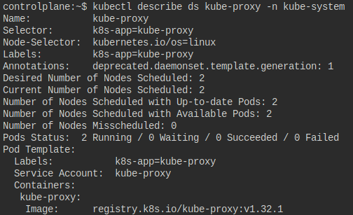
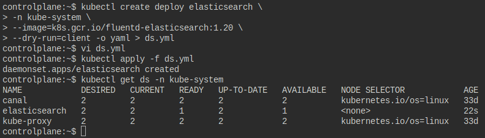
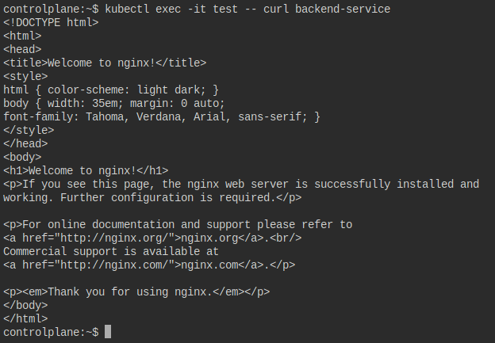
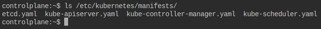
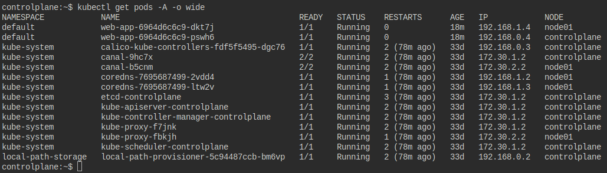

1. How many DaemonSets are created in the cluster in all namespaces?
    ```bash
    kubectl get ds -A
    ```

2. what DaemonSets exist on the `kube-system` namespace?
    ```bash
    kubectl get ds -n kube-system
    ```

3. What is the image used by the POD deployed by the `kube-proxy` DaemonSet?
<p align="center">
  
</p>

---

4. Deploy a DaemonSet for FluentD Logging. Use the given specifications:
- Name: `elasticsearch`
- Namespace: `kube-system`
- Image: `k8s.gcr.io/fluentd-elasticsearch:1.20`
Since there is no create command for DaemonSets, we create a Deployment template and change it to a DaemonSet:
    a. Create a Deployment template:
        ```bash
        kubectl create deploy elasticsearch \
        -n kube-system \
        --image=k8s.gcr.io/fluentd-elasticsearch:1.20 \
        --dry-run=client -o yaml > ds.yml
        ```
    b. Change the template to a DaemonSet by updating the kind and removing replicas, strategy, and status:
        ```
        apiVersion: apps/v1
        kind: DaemonSet
        metadata:
          creationTimestamp: null
          labels:
            app: elasticsearch
          name: elasticsearch
          namespace: kube-system
        spec:
          selector:
            matchLabels:
              app: elasticsearch
          template:
            metadata:
              creationTimestamp: null
              labels:
                app: elasticsearch
            spec:
              containers:
              - image: k8s.gcr.io/fluentd-elasticsearch:1.20
                name: fluentd-elasticsearch
                resources: {}
        ```
    c. Apply the DaemonSet:
        ```bash
        kubectl apply -f ds.yml
        ```
<p align="center">
  
</p>

---

5. Deploy a pod named `nginx-pod` using the `nginx:alpine` image with the labels set to `tier=backend`:
    ```bash
    kubectl run nginx-pod --image=nginx:alpine --labels='tier=backend'
    ```

6. Deploy a `test` pod using the `nginx:alpine` image:
    ```bash
    kubectl run test --image=nginx:alpine
    ```

7. Create a service `backend-service` to expose the backend application within the cluster on port `80`:
    ```bash
    kubectl expose pod nginx-pod --name=backend-service --port=80
    ```

8. try to curl the `backend-service` from the `test` pod. What is the response?
<p align="center">
  
</p>

---

9. Create a deployment named `web-app` using the image `nginx` with `2` replicas:
    ```bash
    kubectl create deploy web-app --image=nginx --replicas=2
    ```

10. Expose the `web-app` as service `web-app-service` application on port `80` and nodeport `30082` on the nodes on the cluster:
    a. Create a Service template:
        ```bash
        kubectl expose deploy web-app \
        --name=web-app-service \
        --type=NodePort \
        --port=80 \
        --dry-run=client -o yaml > svc.yml
        ```
    b. Add `nodePort`:
        ```
        apiVersion: v1
        kind: Service
        metadata:
          creationTimestamp: null
          labels:
            app: web-app
          name: web-app-service
        spec:
          ports:
          - port: 80
            protocol: TCP
            targetPort: 80
            nodePort: 30082
          selector:
            app: web-app
          type: NodePort
        status:
          loadBalancer: {}
        ```
    c. Apply the Service:
        ```bash
        kubectl apply -f svc.yml
        ```

11. Access the web app from the node:
    a. Get the Node's IP:
        ```bash
        kubectl get nodes -o wide
        ```
    b. Access the web app:
        ```bash
        curl http://172.30.1.2:30082
        ```
<p align="center">
  
</p>

---

12. How many static pods exist in this cluster in all namespaces?
<p align="center">
  
</p>

13. On which nodes are the static pods created currently?
-> `controlplane`
<p align="center">
  
</p>

---
