1. How many ConfigMaps exist in the environment?
```bash
kubectl get cm -A
```

2. Create a new ConfigMap Using the spec given below:
ConfigName Name: webapp-config-map
Data: APP_COLOR=darkblue
```bash
kubectl create cm webapp-config-map --from-literal=APP_COLOR=darkblue
```

3. Create a webapp-color POD with nginx image and use the created ConfigMap
a. Create a pod template:
```
kubectl run webapp-color --image=nginx --dry-run=client -o yaml > web-app-pod.yml
```
b. Add the env variable in the manifest file:
```yaml
apiVersion: v1
kind: Pod
metadata:
  creationTimestamp: null
  labels:
    run: webapp-color
  name: webapp-color
spec:
  containers:
  - image: nginx
    name: webapp-color
    resources: {}
    env:
      - name: APP_COLOR
        valueFrom:
          configMapKeyRef:
            name: webapp-config-map
            key: APP_COLOR
  dnsPolicy: ClusterFirst
  restartPolicy: Always
status: {}
```
c. Apply the Pod:
```bash
kubectl apply -f web-app-pod.yml
```

---

4. How many Secrets exist on the system?
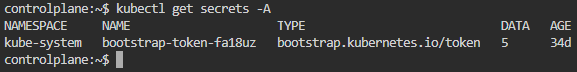

5. How many secrets are defined in the default-token secret?
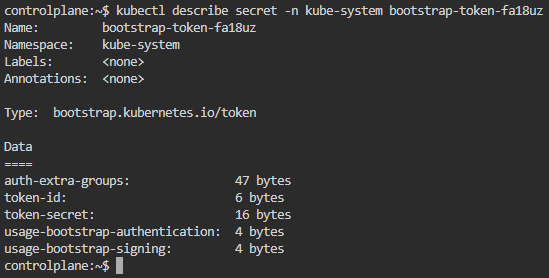

6. create a POD called db-pod with the image mysql:5.7 then check the POD status
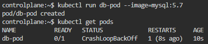

7. why the db-pod status not ready
The root password `MYSQL_ROOT_PASSWORD` must be specified.
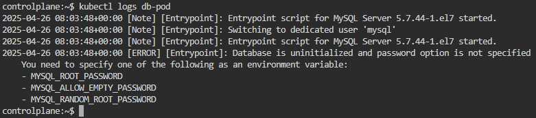

8. Create a new secret named db-secret with the data given below.
- Secret Name: db-secret
- Secret 1: `MYSQL_DATABASE=sql01`
- Secret 2: `MYSQL_USER=user1`
- Secret3: `MYSQL_PASSWORD=password`
- Secret 4: `MYSQL_ROOT_PASSWORD=password123`
```bash
kubectl create secret generic db-secret \
--from-literal=MYSQL_DATABASE=sql01 \
--from-literal=MYSQL_USER=user1 \
--from-literal=MYSQL_PASSWORD=password \
--from-literal=MYSQL_ROOT_PASSWORD=password123
```

9. Configure db-pod to load environment variables from the newly created secret.
Delete and recreate the pod if required.
a. Try to edit the pod (it will fail and save the new file at /tmp):
```bash
kubectl edit pod db-pod
```
b. Add the Secret under the container:
```yaml
envFrom:
  - secretRef:
      name: db-secret
```
c. Replace the old pod:
```bash
kubectl replace --force -f /tmp/kubectl-edit-1689126785.yaml
```

---

10. Create a multi-container pod with 2 containers.
- Pod Name: `yellow`
- Container 1:
    - Name: `lemon`
    - Image: `busybox`
- Container 2:
    - Name: `gold`
    - Image: `redis`
a. Create a Pod template:
```bash
kubectl run yellow --image busybox --dry-run=client -o yaml > yellow-pod.yml
```
b. Edit the manifest file to add the required containers, make sure the busybox container has a command:
```yaml
apiVersion: v1
kind: Pod
metadata:
  labels:
    run: yellow
  name: yellow
spec:
  containers:
  - image: busybox
    name: lemon
    command: ["sleep", "3600"]
    resources: {}
  - image: redis
    name: gold
    resources: {}
  dnsPolicy: ClusterFirst
  restartPolicy: Always
```
c. Apply the Pod:
```bash
kubectl apply -f yellow-pod.yml
```
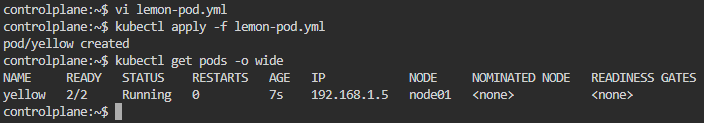

11. Create a pod `red` with `redis` image and use an initContainer that uses the `busybox` image and sleeps for `20` seconds
a. Create a Pod template:
```bash
kubectl run red --image redis --dry-run=client -o yaml > red-pod.yml
```
b. Edit the manifest file to add the initContainers:
```yaml
apiVersion: v1
kind: Pod
metadata:
  creationTimestamp: null
  labels:
    run: red
  name: red
spec:
  containers:
  - image: redis
    name: red
    resources: {}
  initContainers:
  - image: busybox
    name: busybox
    command: ["sleep", "20"]
  dnsPolicy: ClusterFirst
  restartPolicy: Always
status: {}
```
c. Apply the Pod:
```bash
kubectl apply -f yellow-pod.yml
```
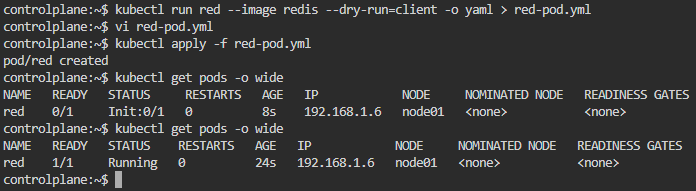

---

12. Create a pod named print-envars-greeting.
    1. Configure spec as, the container name should be `print-env-container` and use bash image.
    2. Create three environment variables:
        a. GREETING and its value should be “Welcome to”
        b. COMPANY and its value should be “DevOps”
        c. GROUP and its value should be “Industries”
    4. Use command to echo ["$(GREETING) $(COMPANY) $(GROUP)"] message.
    5. You can check the output using <kubectl logs -f [ pod-name ]> command.
```yaml
apiVersion: v1
kind: Pod
metadata:
  name: print-envars-greeting
spec:
  containers:
  - name: print-envar-container
    image: bash
    env:
    - name: GREETING
      value: "Welcome to"
    - name: COMPANY
      value: "DevOps"
    - name: GROUP
      value: "Industries"
    command: ["echo", "$(GREETING)", "$(COMPANY)", "$(GROUP)"]
```
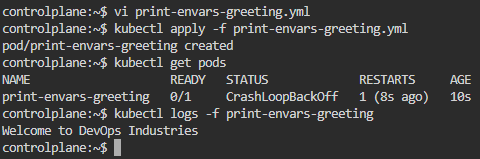

---

13. Where is the default kubeconfig file located in the current environment?
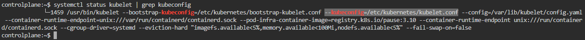

14. How many clusters are defined in the default kubeconfig file?
-> `One`
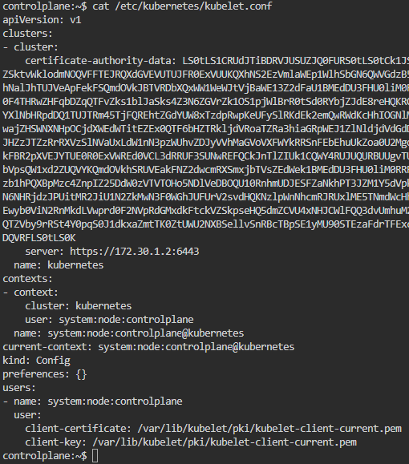

15. What is the user configured in the current context?
-> `system:node:controlplane`

---

16. Create a Persistent Volume with the given specification.
- Volume Name: `pv-log`
- Storage: `100Mi`
- Access Modes: `ReadWriteMany`
- Host Path: `/pv/log`
```yaml
apiVersion: v1
kind: PersistentVolume
metadata:
  name: pv-log
spec:
  storageClassName: "day8"
  capacity:
    storage: 100Mi
  accessModes:
    - ReadWriteMany
  hostPath:
    path: "/mnt/data"
  persistentVolumeReclaimPolicy: Retain
```
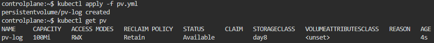

17. Create a Persistent Volume Claim with the given specification.
- Volume Name: `claim-log-1`
- Storage Request: `50Mi`
- Access Modes: `ReadWriteMany`
```yaml
apiVersion: v1
kind: PersistentVolumeClaim
metadata:
  name: claim-log-1
spec:
  storageClassName: "day8"
  volumeName: pv-log
  accessModes:
    - ReadWriteMany
  resources:
    requests:
      storage: 50Mi
```
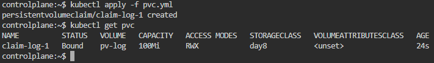

18. Create a webapp pod to use the persistent volume claim as its storage.
- Name: `webapp`
- Image Name: `nginx`
- Volume: `PersistentVolumeClaim=claim-log-1`
- Volume Mount: `/var/log/nginx`
```yaml
apiVersion: v1
kind: Pod
metadata:
  name: webapp
spec:
  volumes:
    - name: log-volume
      persistentVolumeClaim:
        claimName: claim-log-1
  containers:
    - name: nginx
      image: nginx
      imagePullPolicy: Always
      volumeMounts:
        - name: log-volume
          mountPath: "/var/log/nginx"
```
