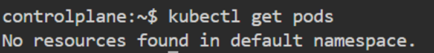
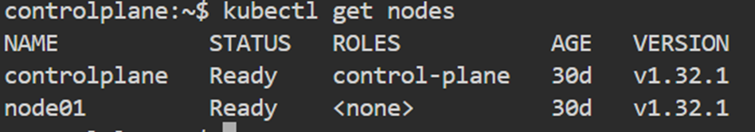
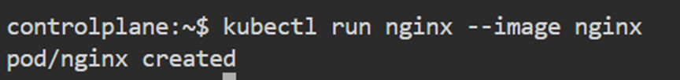
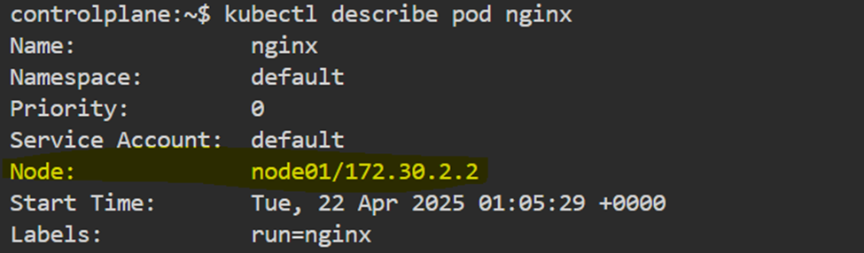
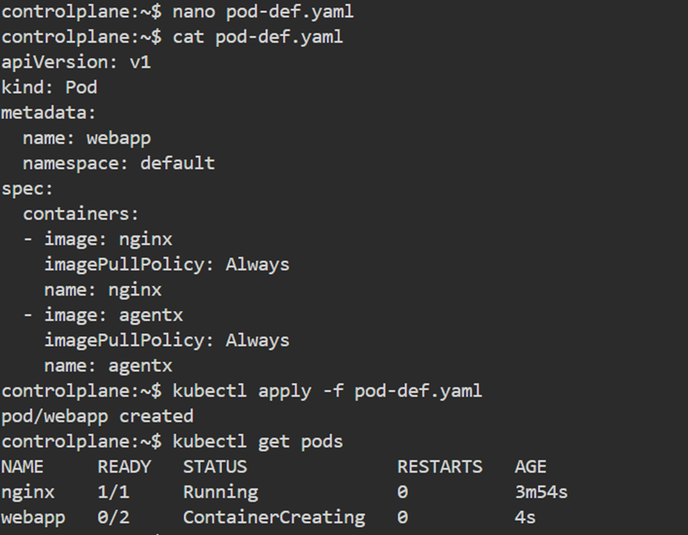
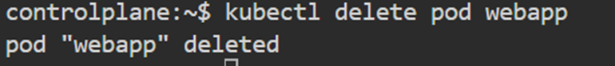
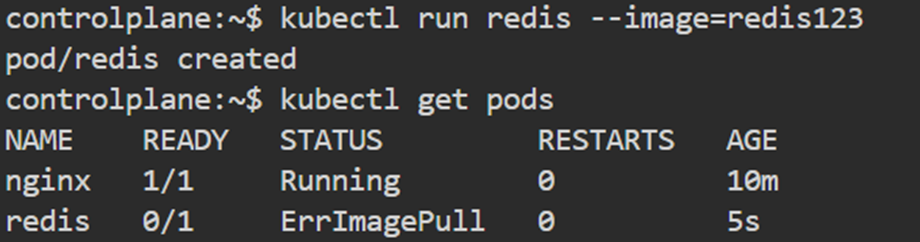
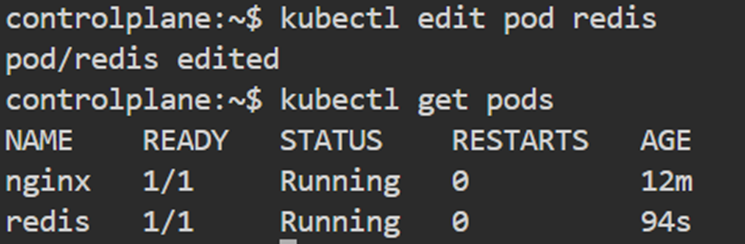
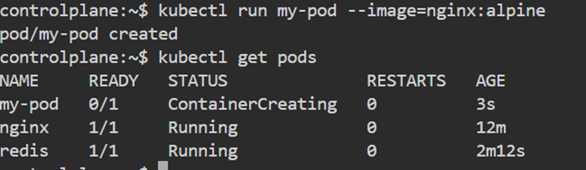
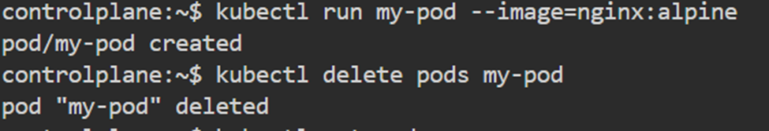

# Lab1 – Pods

## Day 5

### 1. How many pods exist on the system?
**Answer:** Zero pods exist


### 2. How many Nodes exist on the system?
**Answer:** 2 nodes exist



### 3. Create a new pod with the nginx image.
**Image name:** `nginx`



### 4. Which nodes are these pods placed on?



### 5. Create pod from the below YAML using `kubectl apply`:

```yaml
apiVersion: v1
kind: Pod
metadata:
  name: webapp
  namespace: default
spec:
  containers:
    - image: nginx
      imagePullPolicy: Always
      name: nginx
    - image: agentx
      imagePullPolicy: Always
      name: agentx
```





### 6. How many containers are part of the pod `webapp`?
**Answer:** 2 containers

### 7. What images are used in the new `webapp` pod?
**Answer:** `nginx`, `agentx` (but it is not pulled)

### 8. What is the state of the container `agentx` in the pod `webapp`?
**Answer:** state: Waiting, reason: ImagePullBackOff

### 9. Why do you think the container `agentx` in pod `webapp` is in error?
**Answer:** Repository does not exist

### 10. Delete the `webapp` Pod.



### 11. Create a new pod with the name `redis` and with the image `redis123`.
- **Name:** `redis`
- **Image Name:** `redis123`



### 12. Now change the image on this pod to `redis`. Once done, the pod should be in a running state.



### 13. Create a pod called `my-pod` of image `nginx:alpine`.



### 14. Delete the pod called `my-pod`.


