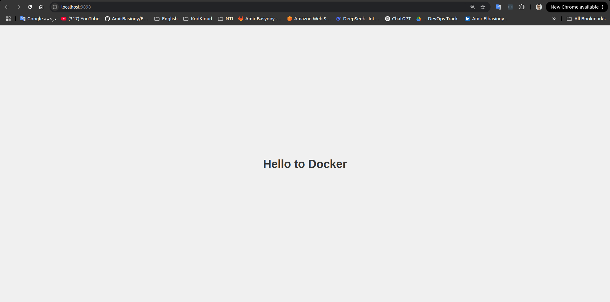

---

## Problem 3
- Run a container httpd with name apache and  
attach a volume 2 volumes to the container  
- Volume1 for containing static html file  
- Volume2 for containing httpd configuration  
- Remove the container  
- Run a new container with the following:  
- Attach the 2 volumes that was attached to the previous container  
- Map port 80 to port 9898 on you host machine  
- Access the html files from your browser  

---

```bash
docker run -d --name apache -v /home/amir/Desktop/StaticWebSite:/usr/local/apache2/htdocs httpd
```
**Output:**
```
bd8b8ba71e4909acd6c4b8947a35c4ebfc1dae8f360ef5e0709d891fa9bf3b98
```
---

```bash
docker stop apache
```
**Output:**
```
apache
```

```bash
docker rm apache
```
**Output:**
```
apache
```
---

```bash
docker run -d --name apache -v /home/amir/Desktop/StaticWebSite:/usr/local/apache2/htdocs -p 9898:80 httpd
```
**Output:**
```
02952b50865d819d103ca3506578a0505e4c8807450fa0538f54baa3d381fc94
```

```bash
docker exec -it apache bash
```
**Output:**
```bash
root@02952b50865d:/usr/local/apache2# ls -l /usr/local/apache2/htdocs
total 4
-rwxrwxrwx 1 root root 566 Apr 14 15:49 index.html
```

```bash
root@02952b50865d:/usr/local/apache2# cat /usr/local/apache2/htdocs/index.html
```
**Output:**
```html
<!DOCTYPE html>
<html lang="en">
<head>
    <meta charset="UTF-8">
    <meta name="viewport" content="width=device-width, initial-scale=1.0">
    <title>Hello to Docker</title>
    <style>
        body {
            display: flex;
            justify-content: center;
            align-items: center;
            height: 100vh;
            margin: 0;
            font-family: Arial, sans-serif;
            background-color: #f0f0f0;
        }
        h1 {
            color: #333;
        }
    </style>
</head>
<body>
    <h1>Hello to Docker</h1>
</body>
</html>
```

```bash
root@02952b50865d:/usr/local/apache2# exit
exit
```

---

```bash
curl http://localhost:9898
```
**Output:**
```html
<!DOCTYPE html>
<html lang="en">
<head>
    <meta charset="UTF-8">
    <meta name="viewport" content="width=device-width, initial-scale=1.0">
    <title>Hello to Docker</title>
    <style>
        body {
            display: flex;
            justify-content: center;
            align-items: center;
            height: 100vh;
            margin: 0;
            font-family: Arial, sans-serif;
            background-color: #f0f0f0;
        }
        h1 {
            color: #333;
        }
    </style>
</head>
<body>
    <h1>Hello to Docker</h1>
</body>
</html>
```

---

### ✅ Validation

You should now be able to access your static website in the browser at:  
`http://localhost:9898`



---
