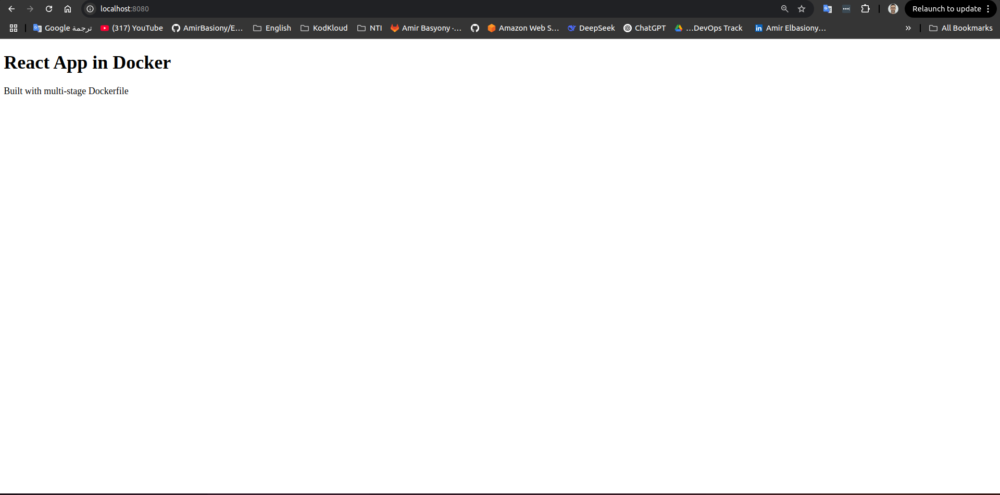

---
##  Task 2
- Create a Dockerfile that:
- Uses node image to build a React application
- Then copies just the built static files to an nginx image

---

## Build the Docker Image

```bash
docker build -t multi-stage .
```

### Output

```plaintext
[+] Building 4.2s (16/16) FINISHED                                                                                                                                            docker:desktop-linux
 => [internal] load build definition from Dockerfile                                                                                                                                          0.1s
 => => transferring dockerfile: 603B                                                                                                                                                          0.0s
 => [internal] load metadata for docker.io/library/nginx:alpine                                                                                                                               3.8s
 => [internal] load metadata for docker.io/library/node:18                                                                                                                                    3.7s
...
 => CACHED [build 7/7] RUN npm run build                                                                                                                                                      0.0s
 => CACHED [stage-1 3/3] COPY --from=build /app/build /usr/share/nginx/html                                                                                                                   0.0s
 => exporting to image                                                                                                                                                                        0.0s
 => => naming to docker.io/library/multi-stage                                                                                                                                                0.0s
```

---

##  Step 3: Run the Container

```bash
docker run --name react-app -p 8080:80 multi-stage
```

### Output

```plaintext
/docker-entrypoint.sh: /docker-entrypoint.d/ is not empty, will attempt to perform configuration
/docker-entrypoint.sh: Looking for shell scripts in /docker-entrypoint.d/
/docker-entrypoint.sh: Launching /docker-entrypoint.d/10-listen-on-ipv6-by-default.sh
10-listen-on-ipv6-by-default.sh: info: Enabled listen on IPv6 in /etc/nginx/conf.d/default.conf
/docker-entrypoint.sh: Launching /docker-entrypoint.d/30-tune-worker-processes.sh
/docker-entrypoint.sh: Configuration complete; ready for start up
2025/04/17 17:23:17 [notice] 1#1: nginx/1.27.5
2025/04/17 17:23:17 [notice] 1#1: start worker processes
2025/04/17 17:23:17 [notice] 1#1: start worker process 30
...
172.17.0.1 - - [17/Apr/2025:17:23:21 +0000] "GET / HTTP/1.1" 304 0 "-" "Mozilla/5.0 (X11; Linux x86_64) Chrome/133.0.0.0 Safari/537.36"
172.17.0.1 - - [17/Apr/2025:17:23:21 +0000] "GET /static/js/main.6d54140b.js HTTP/1.1" 304 0 "http://localhost:8080/"
```

---

## Open in Browser

Visit [http://localhost:8080](http://localhost:8080) to view your React app served by nginx.

### App Successfully Loaded




---
