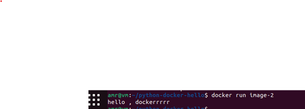

# Running Python in Docker: A Simple Start
**"Hello World" Python app in Docker** using the **official Python Alpine image**, including the Python script, Dockerfile, and a `README.md`.

---

### 📁 File Structure

```
hello-docker/
│
├── app.py      # Python script that prints "Hello Docker!"
├── Dockerfile  # Docker instructions to build the image.
└── README.md   #  You're reading it!
```

---

### 🔹 `app.py`

```python
print("Hello Dockerrrrrr")
```

---

### 🔹 `Dockerfile`

```dockerfile
FROM python:alpine
WORKDIR /app
COPY . .
CMD ["python", "app.py"]
```

## 🚀 How to Run

1. **Build the Docker image**:

   ```bash
   docker build -t hello-docker .
   ```

2. **Run the container**:

   ```bash
   docker run --rm hello-docker
   ```

3. **Expected output**:

   ```
   Hello Dockerrrrr!
   ```


## 📝 Notes

- Uses a lightweight Python image (`python:3.12-alpine`) for minimal footprint.
- The container prints the message and exits.

---
